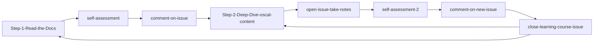

## Bite-sized ComplyTime Outline 🥮

## Table of Contents

  * [**Step 1: Reading `creme-brulee` Course Documentation**](https://github.com/hbraswelrh/creme-brulee/blob/main/.github/steps/1-step.md#-reading-creme-brulee-course-documentation)

      * [Mandatory Review Materials for Course Completion](https://github.com/hbraswelrh/creme-brulee/blob/main/.github/steps/1-step.md#-mandatory-review-materials-for-course-completion)
      * [Take the Self-Assessment](https://github.com/hbraswelrh/creme-brulee/blob/main/.github/steps/1-step.md#-take-the-self-assessment)

  * [**Step 2: Deep Dive into `ComplianceAsCode/oscal-content`**](https://github.com/hbraswelrh/creme-brulee/blob/main/.github/steps/2-step.md#step-2-deep-dive-into-complianceascodeoscal-content)

      * [Mastering the Recipe: A Compliance-as-Code Analogy](https://github.com/hbraswelrh/creme-brulee/blob/main/.github/steps/2-step.md#mastering-the-recipe-a-compliance-as-code-analogy-)
          * [The First-edition Cookbook: ComplianceAsCode/content](https://github.com/hbraswelrh/creme-brulee/blob/main/.github/steps/2-step.md#the-first-edition-cookbook-complianceascodecontent)
          * [The Specialized Cookbook: ComplianceAsCode/oscal-content](https://github.com/hbraswelrh/creme-brulee/blob/main/.github/steps/2-step.md#the-specialized-cookbook-complianceascodeoscal-content)
          * [The Culinary Coordinators: GitHub Actions & complyscribe](https://github.com/hbraswelrh/creme-brulee/blob/main/.github/steps/2-step.md#the-culinary-coordinators-github-actions--complyscribe-)
      * [Mapping `oscal-content` to `ComplianceAsCode/oscal-content` with `complyscribe`](https://github.com/hbraswelrh/creme-brulee/blob/main/.github/steps/2-step.md#mapping-oscal-content-to-complianceascodecontent-with-complyscribe)
          * [Bidirectional Synchronization](https://github.com/hbraswelrh/creme-brulee/blob/main/.github/steps/2-step.md#bidirectional-synchronization)
              * [`sync-oscal-cac`](https://github.com/hbraswelrh/creme-brulee/blob/main/.github/steps/2-step.md#sync-oscal-cac)
              * [`sync-cac-oscal`](https://github.com/hbraswelrh/creme-brulee/blob/main/.github/steps/2-step.md#sync-cac-oscal)
      * [Self-assessment](https://github.com/hbraswelrh/creme-brulee/blob/main/.github/steps/2-step.md#self-assessment)
          * [What You'll Submit](https://github.com/hbraswelrh/creme-brulee/blob/main/.github/steps/2-step.md#what-youll-submit)
      * [Visual Representation](https://github.com/hbraswelrh/creme-brulee/blob/main/.github/steps/2-step.md#visual-representation)
       
     
## Flow of Course Content

## Learning Outcomes 📝

#### 1. Introducing ComplyTime Organization Repositories
  - **Goal:** Get users comfortable with ComplyTime projects and tools. 
  - **Action:** Provide an accessible one-stop shop for repository contents, highlighting the purpose, resources, and best practices for reference.
#### 2. Understand the inter-connected nature of  `oscal-content`, `content`, and `complyscribe`
  - **Goal:** Empower and educate users by breaking down the relationship of the codebases. Leveraging an analogy for clarity on connected nature. 
  - **Action:** Understand the `ComplianceAsCode/oscal-content` capabilities and how synchronization works with `ComplianceAsCode/content`.
#### 3. Review OSCAL Content Updates initiated GitHub Actions
  - **Goal:** Understand practical automations that simplify ComplyTime use-cases.
  - **Action:** Leverage GitHub Actions for maintaining the `ComplianceAsCode/oscal-content` repository.
